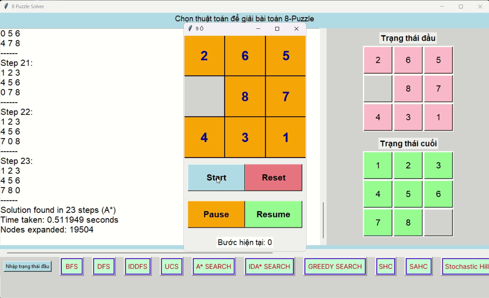
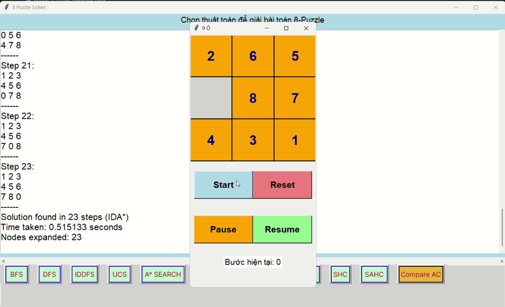
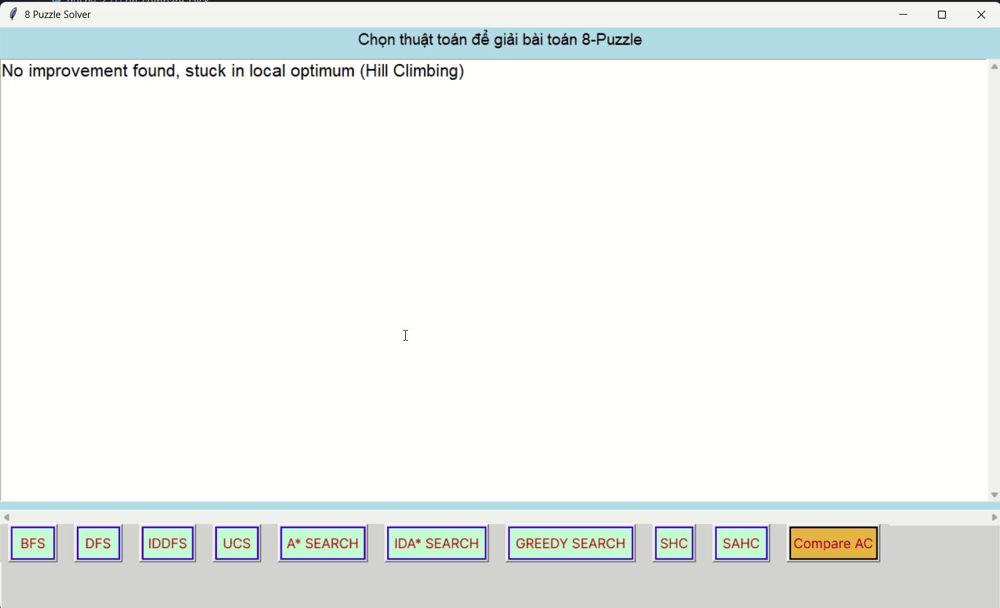
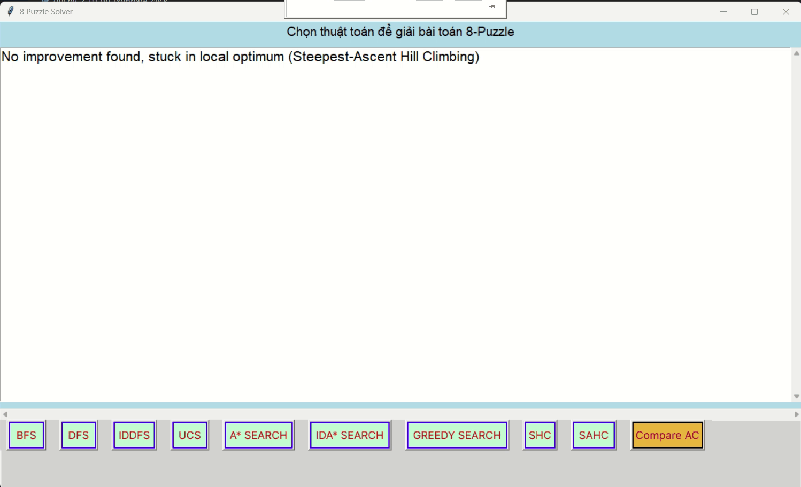
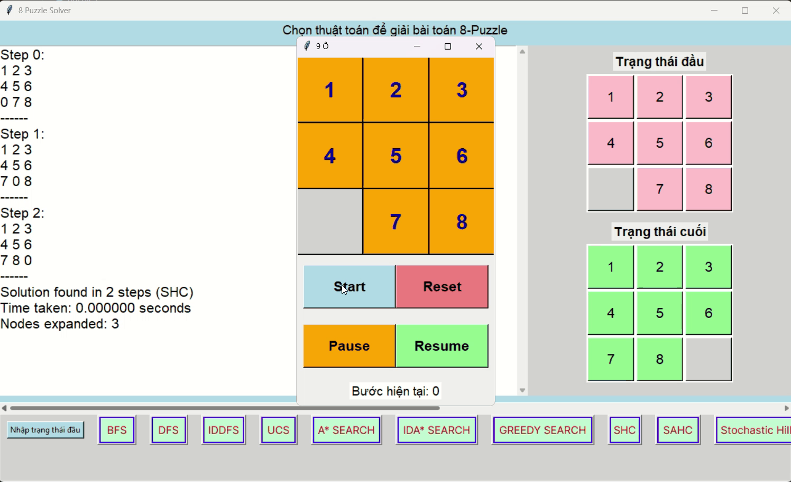
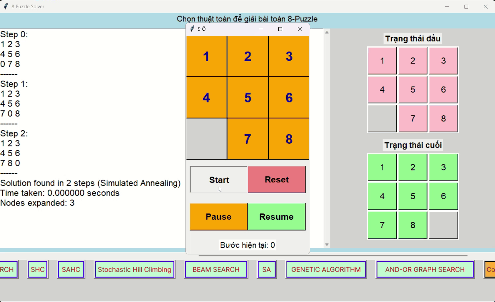

# 23110205_TruongQuangDiep
<<<<<<< HEAD
=======

>>>>>>> b3fbd9a336e7a8e8227f7a530581654a387b44eb
## Thuật toán tìm kiếm:

### BFS (Breadth-First Search)

### UCS (Uniform-Cost Search)

<<<<<<< HEAD
=======
### DFS (Depth-First Search)

>>>>>>> b3fbd9a336e7a8e8227f7a530581654a387b44eb
### IDDFS (Iterative Deepening DFS)

### Greedy Best-First Search

### A* Search
<<<<<<< HEAD

=======

>>>>>>> b3fbd9a336e7a8e8227f7a530581654a387b44eb

### IDA* (Iterative Deepening A*)

### Simple Hill Climbing (SHC)

### Steepest-Ascent Hill Climbing (SAHC)

<<<<<<< HEAD

### Stochastic Hill Climbing

### Simulated Annealing

### Beam Search 

=======
>>>>>>> b3fbd9a336e7a8e8227f7a530581654a387b44eb
